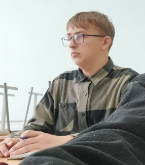
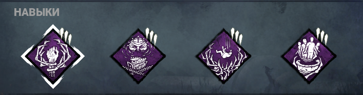
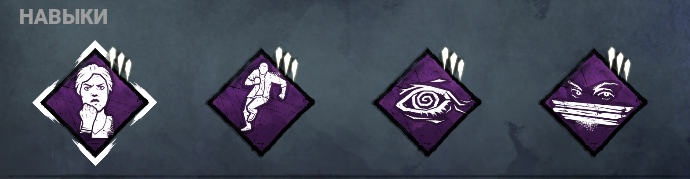
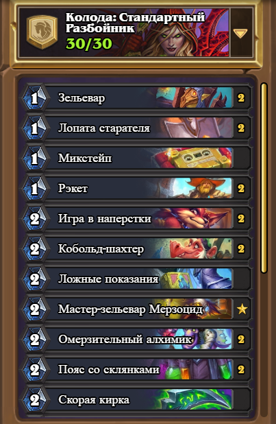
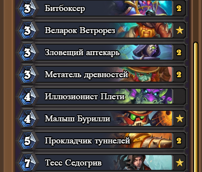

<p align = "center">МИНИСТЕРСТВО НАУКИ И ВЫСШЕГО ОБРАЗОВАНИЯ<br>
РОССИЙСКОЙ ФЕДЕРАЦИИ<br>
ФЕДЕРАЛЬНОЕ ГОСУДАРСТВЕННОЕ БЮДЖЕТНОЕ<br>
ОБРАЗОВАТЕЛЬНОЕ УЧРЕЖДЕНИЕ ВЫСШЕГО ОБРАЗОВАНИЯ<br>
«САХАЛИНСКИЙ ГОСУДАРСТВЕННЫЙ УНИВЕРСИТЕТ»</p>
<br><br><br><br><br><br>
<p align = "center">Институт естественных наук и техносферной безопасности<br>Кафедра информатики<br>Родин Тимур Андреевич</p>
<br><br><br>
<p align = "center"><br><strong>Лабораторная работа №1.«Введение в вэб-разработку».</strong><br>01.03.02 Прикладная математика и информатика</p>
<br><br><br><br><br><br><br><br><br><br><br><br>
<p align = "right">Научный руководитель<br>
Соболев Евгений Игоревич</p>
<br><br><br>
<p align = "center">г. Южно-Сахалинск<br>2024 г.</p>
<br><br><br><br><br><br><br><br><br><br><br><br>

<h1 align = "center">Введение</h1>

<p><b>Веб-разработка</b> — процесс создания веб-сайта или веб-приложения. Основными этапами процесса являются веб-дизайн, вёрстка страниц, программирование на стороне клиента и сервера, а также конфигурирование веб-сервера.
<p><b>Этапы разработки веб-сайта</b>
На сегодняшний день существуют несколько этапов разработки веб-сайта:
<li>Проектирование сайта или веб-приложения (сбор и анализ требований, разработка технического задания, проектирование интерфейсов);</li>
<li>Разработка креативной концепции сайта;</li>
<li>Создание дизайн-концепции сайта;</li>
<li>Создание макетов страниц;</li>
<li>Создание мультимедиа-объектов;</li>
<li>Вёрстка страниц и шаблонов;</li>
<li>Программирование (разработка функциональных инструментов) или интеграция в систему управления содержимым (CMS);</li>
<li>Оптимизация и размещение[уточнить] материалов сайта;</li>
<li>Тестирование и внесение корректировок;</li>
<li>Публикация проекта на хостинге;</li>
<li>Обслуживание работающего сайта или его программной основы.</li>
В зависимости от текущей задачи, какие-то из этапов могут отсутствовать.
<br>
<h1 align = "center">Цели и задачи</h1>
1. Изучить материалы по веб-разработке.<br>
2. Научиться работать в среде Visual studio Code на языке html.<br>
3. Создать сайт с информацией о себе.<br>


<p></p>


<h1 align = "center">Решение</h1>
<h2 align = "center">Файл project.html</h2>

```htmlmixed
<!DOCTYPE html>
<html lang="en">
<head>
    <meta charset="UTF-8">
    <meta name="viewport" content="width=device-width, initial-scale=1.0">
    <link rel="stylesheet" href="styles.css">
    <title>Document</title>
</head>
<body>
    <h1 style="position: relative; left: -100px;">Родин Тимур Андреевич</h1>
    <block>
        <h2>О себе:</a></h2>
        <b style="text-align: center": center> 07.09.2004(19 лет) Родился в городе Крапоткин,<br>сейчас живу в Южно-Сахалинске и учусь в СахГу</b>
        <h2>Достижения:</h2>
        <b>Значимых достижений в области IT не имею.</b>
    </block>
    <h3>Увлечения:</h3>
    <b>Из увлечений у меня компьютерные,настольные игры.</b><br>
    <b style="line-height: 2;">Примеры игр в которые я играю:</b><br>
    <a href=https://en.bandainamcoent.eu>  </a>
    <a href=https://hearthstone.blizzard.com/ru-ru> </a>
    <a href=https://deadbydaylight.com></a><br>
    
    
    
    
    
</body>
</html>
```
<h2 align = "center">Файл styles.css</h2>

```htmlmixed
body {
    background-image: url('pic/фонЭС.jpg');
    background-repeat: no-repeat;
    background-size:cover;
  }
  b
  {
    color:rgb(24, 26, 23);
    font-size: 25px;
    line-height: 1;
  }
  h1 
    {
    text-align: center;
    color:rgb(24, 26, 23);
    font-size: 40px;
    line-height: 1;
    text-shadow: 0px 5px 6px;
    }
    h2 
    {
    color:rgb(24, 26, 23);
    font-size: 40px;
    line-height: 1;
    text-shadow: 0px 5px 6px;
    }
    h3
    {
    color:rgb(24, 26, 23);
    font-size: 40px;
    line-height: 0;
    text-shadow: 0px 5px 6px;
    }
    .round
    {
        border-radius: 200px; /* Радиус скругления */
        border: 3px solid rgb(255, 0, 0); /* Параметры рамки */
        box-shadow: 0 0 7px #666; /* Параметры тени */
    }
```
<h1 align = "center">Вывод</h1>
<p>По итогу проделанной лабораторной работы, я научился работать в среде Visual studio Code на языке html и научился создавать свои собственные сайты.</p>
