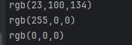

<p align = "center">МИНИСТЕРСТВО НАУКИ И ВЫСШЕГО ОБРАЗОВАНИЯ<br>
РОССИЙСКОЙ ФЕДЕРАЦИИ<br>
ФЕДЕРАЛЬНОЕ ГОСУДАРСТВЕННОЕ БЮДЖЕТНОЕ<br>
ОБРАЗОВАТЕЛЬНОЕ УЧРЕЖДЕНИЕ ВЫСШЕГО ОБРАЗОВАНИЯ<br>
«САХАЛИНСКИЙ ГОСУДАРСТВЕННЫЙ УНИВЕРСИТЕТ»</p>
<br><br><br><br><br><br>
<p align = "center">Институт естественных наук и техносферной безопасности<br>Кафедра информатики<br>Родин Тимур Андреевич/p>
<br><br><br>
<p align = "center"><br><strong>Лабораторная работа №8.«JS»</strong><br>01.03.02 Прикладная математика и информатика</p>
<br><br><br><br><br><br><br><br><br><br><br><br>
<p align = "right">Научный руководитель<br>
Соболев Евгений Игоревич</p>
<br><br><br>
<p align = "center">г. Южно-Сахалинск<br>2024 г.</p>
<br><br><br><br><br><br><br><br><br><br><br><br>

<h1 align = "center">Введение</h1>

<p><b>HTML</b> —  стандартизированный язык гипертекстовой разметки документов для просмотра веб-страниц в браузере. Веб-браузеры получают HTML документ от сервера по протоколам HTTP/HTTPS или открывают с локального диска, далее интерпретируют код в интерфейс, который будет отображаться на экране монитора.</p>
<p><b>CSS</b> — формальный язык описания внешнего вида документа, написанного с использованием языка разметки. Также может применяться к любым XML-документам, например, к SVG или XUL.</p>


<h1 style="text-align: center">Задачи js</h1>
<ol> 
    <li>Напишите оператор if, такой, чтобы в качестве выражения в скобках у него были значения true, false (Например, if( true ) или if( false )). Посмотрите как работает этот оператор, поместив какую-нибудь команду после круглых скобок (Например, console.log(1)).</li> <li>Создайте переменные m и n. В m поместите произвольное числовое значение. Напишите оператор ветвления if так, чтобы если m было больше 50, то в переменную n помещалось слово «большое», иначе — слово «маленькое».</li> <li>Определите сколько раз выполнится цикл while? Примечание: это можно сделать прочитав скрипт или запустив его консоли браузера. <pre><code>var i = 2; while( i < 9 ){ console.log( i++ ); } </code></pre></li> <li>Напишите скрипт, который используя оператор while выведет все числа от 45 до 67.</li> <li>Напишите скрипт, который используя оператор while выведет все числа от 45 до 670, кратные 10.</li> <li>Напишите скрипт, который используя оператор for выполнит два предыдущих задания.</li> <li>Переменная n хранит целое число от 0 до 9. Используя оператор switch, написать скрипт, который в зависимости от числа будет выводить слово (Например, если n равно 3, то будет выводиться слово «три») <pre><code>var n = 5; switch( n ){ //Напишите тут свой код } </code></pre></li> <li>Используя <code>document.write()</code> и любую из циклических конструкций выведите десять одинаковых изображений (надо выводить <code>&lt;img src="..." alt="..." /&gt;</code>)</li> <li>В переменных size и unit хранятся размер и единицы измерения информации 120 и «Кб» соответственно. Зная что могут быть заданные Кб, Мб, Гб (кило-, мега- и гигабайты) и 1килобайт равен 1024 байта, найти количество байт в size.</li> <li>Постройте при помощи циклов JavaScript скрипт для календаря на HTML. Примечание: выполнить задание для одного месяца, используя HTML-элемент <code>table</code></li> <li>Напишите функцию <code>hello1()</code>, которая при вызове будет возвращать строку «Привет, JavaScript!».</li> <li>Напишите функцию <code>hello2()</code>, которая при вызове будет принимать переменную <code>name</code> (например, «Василий») и выводить строку (в нашем случае «Привет, Василий»). В случае отсутствующего аргумента выводить «Привет, гость»</li> <li>Напишите функцию <code>mul(n,m)</code>, которая принимает два аргумента и возвращает произведение этих аргументов. Проверьте ее работу.</li> <li>Создайте функцию <code>repeat(str, n)</code>, которая возвращает строку, состоящую и n повторений строки <code>str</code>. <code>n</code> — по умолчанию 2, <code>str</code> — пустая строка</li> <li>Создайте функцию <code>rgb()</code>, которая будет принимать три числовых аргумента и возвращать строку вида «rgb(23,100,134)». Если аргументы не заданы, считать их равными нулю. Не проверять переменные на тип данных</li> <li>Создайте функцию <code>avg()</code>, которая будет находить среднее значение по всем своим аргументам (аргументы величины числовые).</li> <li>Создайте функцию <code>m(a,b)</code> оболочку для <code>mul()</code>. <code>m()</code> должна принимать два аргумента а возвращать результат работы <code>mul()</code> с этими двумя аргументами После выполнения задания поэкспериментируйте, создайте функцию <code>log()</code>, которая будет принимать одно значение, а вызывать <code>console.log()</code> с этим значением.</li> <li>Напишите функцию <code>operation(m,n,o)</code>, в которой <code>m</code> и <code>n</code> — числовые переменные, а <code>o</code> — функциональный литерал, который берет два аргумента и выполняет математическую операцию над ними</li> <li>Напишите функцию <code>addN(n)</code>, которая вернёт другую функцию. Возвращенная функция должна складывать получаемый аргумент с аргументом <code>n</code> возвращающей функции.</li> <li>Напишите функцию <code>words()</code>, которая в зависимости от переданного в нее целочисленного аргумента <code>n</code>, будет выводить слово «товар» в нужно форме («12 товаров», но «22 товара»). По умолчанию аргумент <code>d</code> должен иметь значение 0</li> 
    <li>Решить задачу на сайте https://www.codewars.com/kata/596fd97f65ad2fc072000037</li>
    <li>Решить задачу на сайте https://www.codewars.com/kata/5925138effaed0de490000cf</li>
    <li>Решить задачу на сайте https://www.codewars.com/kata/59269e371a640c0e98000085</li>
    <li>Решить задачу на сайте https://www.codewars.com/kata/5913ffb2cb1475215c000039</li>
</ol>


<h1 style="text-align: center">Решения CSS</h1>

<h2 style="text-align: center">Файл 1.js</h2>

```js
if (true) {
    console.log(1);
}

if (false) {
    console.log(0);
}
```

<h2 style="text-align: center">Файл 2.js</h2>

```js
let m = 60;
let n;

if (m > 50) {
    n = "большое";
} else {
    n = "маленькое";
}

console.log(n); 
```

<h2 style="text-align: center">Файл 3.js</h2>

```js
let i = 2;
while (i < 9) {
    console.log(i++);
}
```

<h2 style="text-align: center">Файл 4.js</h2>

```js
let number = 45;

while (number <= 67) {
    console.log(number);
    number++;
}
```

<h2 style="text-align: center">Файл 5.js</h2>

```js
let number = 45;

while (number <= 670) {
    if (number % 10 === 0) {
        console.log(number);
    }
    number++;
}
```

<h2 style="text-align: center">Файл 6.js</h2>

```js

console.log("Числа от 45 до 67:");
for (let number = 45; number <= 67; number++) {
    console.log(number);
}


console.log("Числа от 45 до 670, кратные 10:");
for (let number = 45; number <= 670; number++) {
    if (number % 10 === 0) {
        console.log(number);
    }
}
```

<h2 style="text-align: center">Файл 7.js</h2>

```js
let n = 5;

switch (n) {
    case 0:
        console.log("ноль");
        break;
    case 1:
        console.log("один");
        break;
    case 2:
        console.log("два");
        break;
    case 3:
        console.log("три");
        break;
    case 4:
        console.log("четыре");
        break;
    case 5:
        console.log("пять");
        break;
    case 6:
        console.log("шесть");
        break;
    case 7:
        console.log("семь");
        break;
    case 8:
        console.log("восемь");
        break;
    case 9:
        console.log("девять");
        break;
    default:
        console.log("Число не входит в диапазон от 0 до 9");
        break;
}
```

<h2 style="text-align: center">Файл 8.js</h2>

```js
for (var i = 0; i < 10; i++) {
    document.write('');
}
```

<h2 style="text-align: center">Файл 9.js</h2>

```js
let size = 120;
let unit = "Кб";
let bytes;

switch (unit) {
    case "Кб":
        bytes = size * 1024;
        break;
    case "Мб":
        bytes = size * 1024 * 1024;
        break;
    case "Гб":
        bytes = size * 1024 * 1024 * 1024;
        break;
    default:
        console.log("Неподдерживаемая единица измерения.");
}

console.log("Количество байт в size:", bytes);
```

<h2 style="text-align: center">Файл 10.js</h2>

```html
<!DOCTYPE html>
<html lang="en">
<head>
    <meta charset="UTF-8">
    <title>Title</title>
</head>
<body>
<table id="calendar">

</table>
<script>
    let month = 4;
    let year = 2024;

    let table = document.getElementById("calendar");

    let headerRow = table.insertRow();
    let headerCell = headerRow.insertCell();
    headerCell.colSpan = 7;
    headerCell.textContent = new Date(year, month).toLocaleString("default", { month: "long", year: "numeric" });
    headerCell.classList.add("header");

    let daysOfWeek = ["Пн", "Вт", "Ср", "Чт", "Пт", "Сб", "Вс"];
    let daysRow = table.insertRow();
    for (let i = 0; i < daysOfWeek.length; i++) {
        let daysCell = daysRow.insertCell();
        daysCell.textContent = daysOfWeek[i];
        daysCell.classList.add("day-of-week");
    }

    let firstDay = new Date(year, month, 0).getDay();

    let daysInMonth = new Date(year, month + 1, 0).getDate();

    let currentDay = 1;
    for (let week = 0; week < 6; week++) {
        let weekRow = table.insertRow();
        for (let dayOfWeek = 0; dayOfWeek < 7; dayOfWeek++) {
            let dayCell = weekRow.insertCell();
            if (week === 0 && dayOfWeek < firstDay) {
                dayCell.classList.add("empty");
            } else if (currentDay > daysInMonth) {
                dayCell.classList.add("empty");
            } else {
                dayCell.textContent = currentDay;
                dayCell.classList.add("day");
                currentDay++;
            }
        }
    }
</script>
</body>
</html>
```

<h2 style="text-align: center">Файл 11.js</h2>

```js
function hello1() {
    return "Привет, JavaScript!";
}

console.log(hello1());
```

<h2 style="text-align: center">Файл 12.js</h2>

```js
function hello2(name) {
    if (name) {
        return "Привет, " + name + "!";
    }

    return "Привет, гость!";
}


console.log(hello2("Василий"));
console.log(hello2());
```

<h2 style="text-align: center">Файл 13.js</h2>

```js
function mul(n, m) {
    return n * m;
}

console.log(mul(5, 7));
console.log(mul(2, 3));
```

<h2 style="text-align: center">Файл 14.js</h2>

```js
function repeat(str = "", n = 2) {
    return str.repeat(n);
}

console.log(repeat("Hello", 3));
console.log(repeat("JavaScript"));
console.log(repeat());
```

<h2 style="text-align: center">Файл 15.js</h2>

```js
function rgb(red = 0, green = 0, blue = 0) {
    return "rgb(" + red + "," + green + "," + blue + ")";
}

console.log(rgb(23, 100, 134));
console.log(rgb(255, 0, 0));
console.log(rgb());
```

<h2 style="text-align: center">Файл 16.js</h2>

```js
function avg(...args) {
    if (args.length === 0) {
        return 0;
    }

    const sum = args.reduce((acc, val) => acc + val, 0);
    return sum / args.length;
}

console.log(avg(2, 4, 6));
console.log(avg(10, 20, 30, 40, 50));
console.log(avg());

```

<h2 style="text-align: center">Файл 17.js</h2>

```js
function mul(n, m) {
    return n * m;
}

function m(a, b) {
    return mul(a, b);
}

console.log(m(2, 3));
console.log(m(5, 7));
```

<h2 style="text-align: center">Файл 18.js</h2>

```js
function operation(m, n, o) {
    return o(m, n);
}

const sum = function(a, b) {
    return a + b;
};

console.log(operation(2, 3, sum));

const multiply = function(a, b) {
    return a * b;
};

console.log(operation(4, 5, multiply));
```

<h2 style="text-align: center">Файл 19.js</h2>

```js
function addN(n) {
    return function(x) {
        return x + n;
    };
}

const add5 = addN(5);

console.log(add5(10));
console.log(add5(7));

const add3 = addN(3);

console.log(add3(8));
console.log(add3(2));
```

<h2 style="text-align: center">Файл 20.js</h2>

```js
function words(n) {
    if (n === 0) {
        return 'товаров';
    }

    const lastDigit = n % 10;
    const lastTwoDigits = n % 100;

    if (lastTwoDigits >= 11 && lastTwoDigits <= 19) {
        return 'товаров';
    } else if (lastDigit === 1) {
        return 'товар';
    } else if (lastDigit >= 2 && lastDigit <= 4) {
        return 'товара';
    } else {
        return 'товаров';
    }
}

console.log(words(0));
console.log(words(1));
console.log(words(2));
console.log(words(5));
console.log(words(11));
console.log(words(22));
console.log(words(100));
```

<h2 style="text-align: center">Файл 21.js</h2>

```js
class Converter {
    constructor(size, unit) {
        switch (unit) {
            case "KB":
                this.sizeB = size * 1024;
                break;
            case "MB":
                this.sizeB = size * 1048576;
                break;
            case "GB":
                this.sizeB = size * 1073741824;
                break;
            case 'TB':
                this.sizeB = size * 1099511627776;
                break;
            default:
                this.sizeB = size
        }
    }

    toB() {
        this.size = this.sizeB;
        this.round();
        this.unit = 'B';
        this.size = this.size + ' ' + this.unit;
    }

    toKB() {
        this.size = this.sizeB / 1024;
        this.round();
        this.unit = 'KB';
        this.size = this.size + ' ' + this.unit;
    }

    toMB() {
        this.size = this.sizeB / 1048576;
        this.round();
        this.unit = 'MB';
        this.size = this.size + ' ' + this.unit;
    }

    toGB() {
        this.size = this.sizeB / 1073741824;
        this.round();
        this.unit = 'GB';
        this.size = this.size + ' ' + this.unit;
    }

    toTB() {
        this.size = this.sizeB / 1099511627776;
        this.round();
        this.unit = 'TB';
        this.size = this.size + ' ' + this.unit;
    }
    round() {
        if (!Number.isInteger(this.size)) {
            this.size = Math.floor(this.size * 1000) / 1000;
        }
    }
}
```

<h2 style="text-align: center">Файл 22.js</h2>

```js
function tiaosheng(failedCount) {
    if (failedCount.length === 0) {
        return 60;
    }

    let jumps = 60;
    let number = 0;

    for (var key = 0; key < failedCount.length; key++) {
        key = Number(key);
        let current = failedCount[key];
        number = current + 3 * key;

        if (number < 57) {
            jumps = current - 3 * key;
        } else if (number >= 57 && number <= 60) {
            return current;
        } else {
            return 60 - (3 * key);
        }
    }

    if (number < 57) {
        return 60 - (3 * key);
    }

    return jumps;
}

console.log(tiaosheng([3, 7, 12, 13, 15, 17, 19, 20, 22, 23, 24, 25, 27, 28, 29, 31, 32, 33, 36, 38, 40, 42, 47, 48, 50, 51, 56, 57, 58]))
```

<h2 style="text-align: center">Файл 23.js</h2>

```js
function xPlusY(n) {
    if (!/^[01]+$/.test(n)) {
        return 0;
    }
    n = n.split('');

    let turns = 0;
    for (let i = 0; i < n.length; i++) {
        if (n[i] === '1') {
            if (n[i + 1] !== undefined && n[i + 1] === '0') {
                n[i] = '0';
                n[i + 1] = '1'
                turns++;
            } else if (n[i + 1] !== undefined && n[i + 1] === '1') {
                n[i] = '0';
                n[i + 1] = '0'
                turns++;
            }
        }
    }

    if (n[n.length - 1] === '1') {
        turns++;
    }

    return turns;
}

console.log(xPlusY('11'))
```

<h2 style="text-align: center">Файл 24.js</h2>

```js
function countTriangles(n) {
    return Math.floor(n + n*n*(6*n+9)/2)
}

console.log(countTriangles(4));
```


<h1 align = "center">Результат HTML</h1>

<ol>
  <li>
    <div style="display: flex; flex-direction: column">
        <div>Напишите оператор if, такой, чтобы в качестве выражения в скобках у него были значения true, false (Например, if( true ) или if( false )). Посмотрите как работает этот оператор, поместив какую-нибудь команду после круглых скобок (Например, console.log(1)).</div>
        
    </div>
  </li>
  <li>
    <div style="display: flex; flex-direction: column">
        <div>Создайте переменные m и n. В m поместите произвольное числовое значение. Напишите оператор ветвления if так, чтобы если m было больше 50, то в переменную n помещалось слово «большое», иначе — слово «маленькое».</div>
        
    </div>
  </li>
  <li>
    <div style="display: flex; flex-direction: column">
        <div>Определите сколько раз выполнится цикл while? Примечание: это можно сделать прочитав скрипт или запустив его консоли браузера. <pre><code>var i = 2; while( i < 9 ){ console.log( i++ ); } </code></pre></div>
        
    </div>
  </li>
  <li>
    <div style="display: flex; flex-direction: column">
        <div>Напишите скрипт, который используя оператор while выведет все числа от 45 до 67.</div>
        
    </div>
  </li>
  <li>
    <div style="display: flex; flex-direction: column">
        <div>Напишите скрипт, который используя оператор while выведет все числа от 45 до 670, кратные 10.</div>
        
    </div>
  </li>
  <li>
    <div style="display: flex; flex-direction: column">
        <div>Напишите скрипт, который используя оператор for выполнит два предыдущих задания.</div>
        
    </div>
  </li>
  <li>
    <div style="display: flex; flex-direction: column">
        <div>Переменная n хранит целое число от 0 до 9. Используя оператор switch, написать скрипт, который в зависимости от числа будет выводить слово (Например, если n равно 3, то будет выводиться слово «три») <pre><code>var n = 5; switch( n ){ //Напишите тут свой код } </code></pre></div>
        
    </div>
  </li>
  <li>
    <div style="display: flex; flex-direction: column">
        <div> Используя <code>document.write()</code> и любую из циклических конструкций выведите десять одинаковых изображений (надо выводить <code>&lt;img src="..." alt="..." /&gt;</code>)</div>
        
    </div>
  </li>
  <li>
    <div style="display: flex; flex-direction: column">
        <div>В переменных size и unit хранятся размер и единицы измерения информации 120 и «Кб» соответственно. Зная что могут быть заданные Кб, Мб, Гб (кило-, мега- и гигабайты) и 1килобайт равен 1024 байта, найти количество байт в size.</div>
        
    </div>
  </li>
  <li>
    <div style="display: flex; flex-direction: column">
        <div>Постройте при помощи циклов JavaScript скрипт для календаря на HTML. Примечание: выполнить задание для одного месяца, используя HTML-элемент <code>table</code></div>
        
    </div>
  </li>
  <li>
    <div style="display: flex; flex-direction: column">
        <div>Напишите функцию <code>hello1()</code>, которая при вызове будет возвращать строку «Привет, JavaScript!».</div>
        
    </div>
  </li>
  <li>
    <div style="display: flex; flex-direction: column">
        <div>Напишите функцию <code>hello2()</code>, которая при вызове будет принимать переменную <code>name</code> (например, «Василий») и выводить строку (в нашем случае «Привет, Василий»). В случае отсутствующего аргумента выводить «Привет, гость»</div>
        
    </div>
  </li>
  <li>
    <div style="display: flex; flex-direction: column">
        <div>Напишите функцию <code>mul(n,m)</code>, которая принимает два аргумента и возвращает произведение этих аргументов. Проверьте ее работу.</div>
        
    </div>
  </li>
  <li>
    <div style="display: flex; flex-direction: column">
        <div>Создайте функцию <code>repeat(str, n)</code>, которая возвращает строку, состоящую и n повторений строки <code>str</code>. <code>n</code> — по умолчанию 2, <code>str</code> — пустая строка</div>
        
    </div>
  </li>
  <li>
    <div style="display: flex; flex-direction: column">
        <div>Создайте функцию <code>rgb()</code>, которая будет принимать три числовых аргумента и возвращать строку вида «rgb(23,100,134)». Если аргументы не заданы, считать их равными нулю. Не проверять переменные на тип данных</div>
        
    </div>
  </li>
  <li>
    <div style="display: flex; flex-direction: column">
        <div>Создайте функцию <code>avg()</code>, которая будет находить среднее значение по всем своим аргументам (аргументы величины числовые).</div>
        
    </div>
  </li>
  <li>
    <div style="display: flex; flex-direction: column">
        <div>Создайте функцию <code>m(a,b)</code> оболочку для <code>mul()</code>. <code>m()</code> должна принимать два аргумента а возвращать результат работы <code>mul()</code> с этими двумя аргументами После выполнения задания поэкспериментируйте, создайте функцию <code>log()</code>, которая будет принимать одно значение, а вызывать <code>console.log()</code> с этим значением.</div>
        
    </div>
  </li>
  <li>
    <div style="display: flex; flex-direction: column">
        <div>Напишите функцию <code>operation(m,n,o)</code>, в которой <code>m</code> и <code>n</code> — числовые переменные, а <code>o</code> — функциональный литерал, который берет два аргумента и выполняет математическую операцию над ними</div>
        
    </div>
  </li>
  <li>
    <div style="display: flex; flex-direction: column">
        <div>Напишите функцию <code>addN(n)</code>, которая вернёт другую функцию. Возвращенная функция должна складывать получаемый аргумент с аргументом <code>n</code> возвращающей функции.</div>
        
    </div>
  </li>
  <li>
    <div style="display: flex; flex-direction: column">
        <div>Напишите функцию <code>words()</code>, которая в зависимости от переданного в нее целочисленного аргумента <code>n</code>, будет выводить слово «товар» в нужно форме («12 товаров», но «22 товара»). По умолчанию аргумент <code>d</code> должен иметь значение 0</div>
        
    </div>
  </li>
  <li>
    <div style="display: flex; flex-direction: column">
        <div>Решить задачу на сайте https://www.codewars.com/kata/596fd97f65ad2fc072000037</div>
        
    </div>
  </li>
  <li>
    <div style="display: flex; flex-direction: column">
        <div> Решить задачу на сайте https://www.codewars.com/kata/5925138effaed0de490000cf</div>
        
    </div>
  </li>
  <li>
    <div style="display: flex; flex-direction: column">
        <div>Решить задачу на сайте https://www.codewars.com/kata/59269e371a640c0e98000085</div>
        
    </div>
  </li>
  <li>
    <div style="display: flex; flex-direction: column">
        <div>Решить задачу на сайте https://www.codewars.com/kata/5913ffb2cb1475215c000039</div>
        
    </div>
  </li>
</ol>

<h1 align = "center">Вывод</h1>
<p>В ходе выполнения лабораторной работы по js были рассмотрены различные селекторы, которые позволяют выбирать и стилизовать определенные элементы на веб-странице, также были изучены методы работы с массивами.</p>
