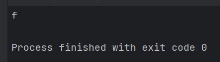
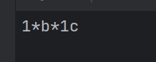
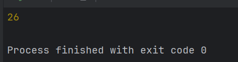
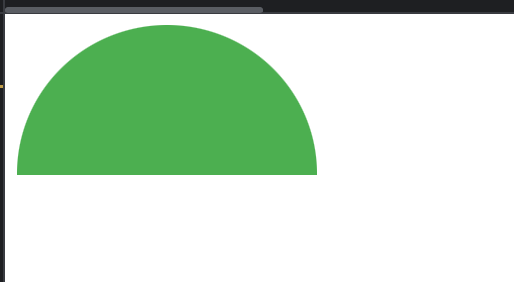
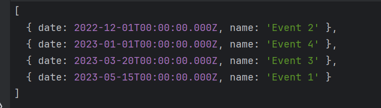
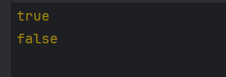
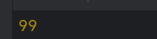
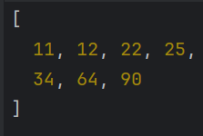
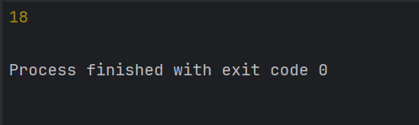
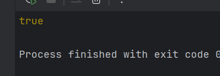

<p align = "center">МИНИСТЕРСТВО НАУКИ И ВЫСШЕГО ОБРАЗОВАНИЯ<br>
РОССИЙСКОЙ ФЕДЕРАЦИИ<br>
ФЕДЕРАЛЬНОЕ ГОСУДАРСТВЕННОЕ БЮДЖЕТНОЕ<br>
ОБРАЗОВАТЕЛЬНОЕ УЧРЕЖДЕНИЕ ВЫСШЕГО ОБРАЗОВАНИЯ<br>
«САХАЛИНСКИЙ ГОСУДАРСТВЕННЫЙ УНИВЕРСИТЕТ»</p>
<br><br><br><br><br><br>
<p align = "center">Институт естественных наук и техносферной безопасности<br>Кафедра информатики<br>Родин Тимур Андреевич</p>
<br><br><br>
<p align = "center"><br><strong>Лабораторная работа №9.«JS»</strong><br>01.03.02 Прикладная математика и информатика</p>
<br><br><br><br><br><br><br><br><br><br><br><br>
<p align = "right">Научный руководитель<br>
Соболев Евгений Игоревич</p>
<br><br><br>
<p align = "center">г. Южно-Сахалинск<br>2024 г.</p>
<br><br><br><br><br><br><br><br><br><br><br><br>

<h1 align = "center">Введение</h1>

<p><b>HTML</b> —  стандартизированный язык гипертекстовой разметки документов для просмотра веб-страниц в браузере. Веб-браузеры получают HTML документ от сервера по протоколам HTTP/HTTPS или открывают с локального диска, далее интерпретируют код в интерфейс, который будет отображаться на экране монитора.</p>
<p><b>CSS</b> — формальный язык описания внешнего вида документа, написанного с использованием языка разметки. Также может применяться к любым XML-документам, например, к SVG или XUL.</p>


<h1 style="text-align: center">Задачи js</h1>
<ol> <li>Есть некоторая строка (var str = 'fgfggg';), что будет, если мы возьмем str[0]?</li> <li>Дана функция, она принимает в качестве аргументов строки '*', '1', 'b', '1c', реализуйте ее так, что бы она вернула строку '1*b*1c'</li> <li>Дано дерево, надо найти сумму всех вершин.</li> <li>Нарисовать стилями полукруг.</li> <li>Есть массив в котором лежат объекты с датами, отсортировать по датам.</li> <li>Есть несколько слов, определить состоят ли они из одних и тех же букв('кот', 'ток', 'окт')</li> <li>От них же. Числа от 1 до 100 лежат в массиве, они хаотично перемешанные, от туда изъяли одно число, надо найти, что это за число. алгоритм не должен превышать O(n^2) сложности.</li> <li>Реализовать сортировку пузырьком.</li> <li>Обратная польская нотация.</li> <li>Реализовать функцию является ли слово палендром.</li> </ol>


<h1 style="text-align: center">Решения CSS</h1>

<h2 style="text-align: center">Файл 1.js</h2>

```js
var str = 'fgfggg';

console.log(str[0]);
```

<h2 style="text-align: center">Файл 2.js</h2>

```js
function formatString(separator, ...args) {
    let result = '';
    for (let i = 0; i < args.length; i++) {
        if (args[i] !== '') {
            if (result !== '') {
                result += separator;
            }
            result += args[i];
        }
    }
    return result;
}

console.log(formatString('*', '', '1', 'b', '1c'));
```

<h2 style="text-align: center">Файл 3.js</h2>

```js
class TreeNode {
    constructor(val, left = null, right = null) {
        this.val = val;
        this.left = left;
        this.right = right;
    }
}

function sumOfAllNodes(root) {
    if (!root) {
        return 0;
    }
    return root.val + sumOfAllNodes(root.left) + sumOfAllNodes(root.right);
}

const root = new TreeNode(1,
    new TreeNode(2,
        new TreeNode(4),
        new TreeNode(10)),
    new TreeNode(3,
        null,
        new TreeNode(6)));

console.log(sumOfAllNodes(root));
```

<h2 style="text-align: center">Файл 4.js</h2>

```html
<!DOCTYPE html>
<html>
<head>
    <title>Полукруг</title>
    <style>
        .semicircle {
            width: 200px;
            height: 100px;
            background-color: #4CAF50;
            border-radius: 100px 100px 0 0;
        }
    </style>
</head>
<body>
<div class="semicircle"></div>
</body>
</html>
```

<h2 style="text-align: center">Файл 5.js</h2>

```js
const events = [
    { date: new Date('2023-05-15'), name: 'Event 1' },
    { date: new Date('2022-12-01'), name: 'Event 2' },
    { date: new Date('2023-03-20'), name: 'Event 3' },
    { date: new Date('2023-01-01'), name: 'Event 4' }
];

events.sort((a, b) => a.date.getTime() - b.date.getTime());

console.log(events);
```

<h2 style="text-align: center">Файл 6.js</h2>

```js
function areAnagrams(words) {
    function sortLetters(word) {
        return word.split('').sort().join('');
    }
    const sortedWords = words.map(sortLetters);
    return sortedWords.every((word, i) => word === sortedWords[0]);
}

const words = ['кот', 'ток', 'окт'];
console.log(areAnagrams(words));

const notAnagrams = ['кот', 'ток', 'око'];
console.log(areAnagrams(notAnagrams));
```

<h2 style="text-align: center">Файл 7.js</h2>

```js
function findMissingNumber(numbers) {
    const fullArray = Array.from({ length: 100 }, (_, i) => i + 1);
    return fullArray.filter(num => !numbers.includes(num))[0];
}

const numbers = [1,2, 4, 3, 5, 6, 7, 8, 9, 10, 11, 12, 13, 14, 15, 16, 17, 18, 19, 20, 21, 22, 23, 24, 25, 26, 27, 28, 29, 30, 31, 32, 33, 34, 35, 36, 37, 38, 39, 40, 41, 42, 43, 44, 45, 46, 47, 48, 49, 50, 51, 52, 53, 54, 55, 56, 57, 58, 59, 60, 61, 62, 63, 64, 65, 66, 67, 68, 69, 70, 71, 72, 73, 74, 75, 76, 77, 78, 79, 80, 81, 82, 83, 84, 85, 86, 87, 88, 89, 90, 91, 92, 93, 94, 95, 96, 97, 98, 100];
const missingNumber = findMissingNumber(numbers);
console.log(missingNumber);
```

<h2 style="text-align: center">Файл 8.js</h2>

```js
function bubbleSort(arr) {
    const n = arr.length;

    for (let i = 0; i < n - 1; i++) {
        for (let j = 0; j < n - i - 1; j++) {
            if (arr[j] > arr[j + 1]) {
                // Меняем элементы местами
                [arr[j], arr[j + 1]] = [arr[j + 1], arr[j]];
            }
        }
    }

    return arr;
}

// Пример использования
const unsortedArray = [64, 34, 25, 12, 22, 11, 90];
const sortedArray = bubbleSort(unsortedArray);
console.log(sortedArray);
```

<h2 style="text-align: center">Файл 9.js</h2>

```js
class Stack {
    constructor() {
        this.items = [];
    }

    push(element) {
        this.items.push(element);
    }

    pop() {
        if (this.items.length === 0) {
            return "Стек пуст";
        }
        return this.items.pop();
    }

    peek() {
        return this.items[this.items.length - 1];
    }

    isEmpty() {
        return this.items.length === 0;
    }

    clear() {
        this.items = [];
    }
}

function calculateRPN(expression) {
    const stack = new Stack();

    const tokens = expression.split(" ");

    for (let token of tokens) {
        if (!isNaN(parseFloat(token))) {
            stack.push(parseFloat(token));
        } else {

            const b = stack.pop();
            const a = stack.pop();

            switch (token) {
                case "+":
                    stack.push(a + b);
                    break;
                case "-":
                    stack.push(a - b);
                    break;
                case "*":
                    stack.push(a * b);
                    break;
                case "/":
                    stack.push(a / b);
                    break;
                default:
                    throw new Error("Неизвестная операция: " + token);
            }
        }
    }

    return stack.pop();
}

const rpnExpression = "5 3 + 2 * 2 +";
const result = calculateRPN(rpnExpression);
console.log(result);
```

<h2 style="text-align: center">Файл 10.js</h2>

```js
function isPalindrome(word) {
    word = word.replace(/\s/g, '').toLowerCase();

    return word === word.split('').reverse().join('');
}

console.log(isPalindrome("Бел хлеб"));
```


<h1 align = "center">Результат HTML</h1>

<ol>
  <li>
    <div style="display: flex; flex-direction: column">
        <div>Есть некоторая строка (var str = 'fgfggg';), что будет, если мы возьмем str[0]?</div>
        
    </div>
  </li>
  <li>
    <div style="display: flex; flex-direction: column">
        <div>Дана функция, она принимает в качестве аргументов строки '*', '1', 'b', '1c', реализуйте ее так, что бы она вернула строку '1*b*1c'</div>
        
    </div>
  </li>
  <li>
    <div style="display: flex; flex-direction: column">
        <div>Дано дерево, надо найти сумму всех вершин.</div>
        
    </div>
  </li>
  <li>
    <div style="display: flex; flex-direction: column">
        <div>Нарисовать стилями полукруг.</div>
        
    </div>
  </li>
  <li>
    <div style="display: flex; flex-direction: column">
        <div>Есть массив в котором лежат объекты с датами, отсортировать по датам.</div>
        
    </div>
  </li>
  <li>
    <div style="display: flex; flex-direction: column">
        <div>Есть несколько слов, определить состоят ли они из одних и тех же букв('кот', 'ток', 'окт')</div>
        
    </div>
  </li>
  <li>
    <div style="display: flex; flex-direction: column">
        <div>От них же. Числа от 1 до 100 лежат в массиве, они хаотично перемешанные, от туда изъяли одно число, надо найти, что это за число. алгоритм не должен превышать O(n^2) сложности.</div>
        
    </div>
  </li>
  <li>
    <div style="display: flex; flex-direction: column">
        <div> Реализовать сортировку пузырьком.</div>
        
    </div>
  </li>
  <li>
    <div style="display: flex; flex-direction: column">
        <div>Обратная польская нотация.</div>
        
    </div>
  </li>
  <li>
    <div style="display: flex; flex-direction: column">
        <div>Реализовать функцию является ли слово палендром.</div>
        
    </div>
  </li>
</ol>

<h1 align = "center">Вывод</h1>
<p>В ходе выполнения лабораторной работы по js были рассмотрены различные селекторы, которые позволяют выбирать и стилизовать определенные элементы на веб-странице. Также применены алгоритмы работы с циклами списками и друг  ми структурами данных на js.</p>
